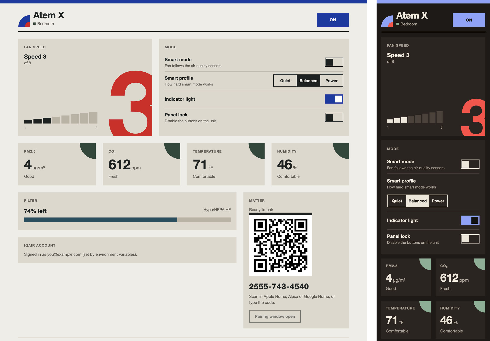

# iqair-matter

Control an **IQAir Atem X** air purifier from Apple Home / Siri, Alexa and Google Home.

The Atem X has no local API. Every TCP port on the unit is closed, and it only talks to
IQAir's cloud over MQTT. This bridge is a small Rust service that:

- talks to IQAir's (undocumented) cloud API to read and control the purifier,
- presents it on your LAN as a **Matter** Air Purifier (on/off, 8 fan speeds, smart/auto),
- serves a local **web UI** with controls, air-quality readings, filter life and the Matter
  pairing code.

It's an approximately 4 MB container that idles at a few MB of RAM.



```
Siri / Alexa / Google ──Matter──▶ iqair-matter ──HTTPS/gRPC-web──▶ IQAir cloud ──▶ Atem X
                                    │
                        browser ◀───┘ web UI :8080
```

## Deploy (Komodo / Docker Compose)

Matter finds devices with mDNS and IPv6 on the local link, which Docker's default bridge
network blocks. Give the container its own LAN address with **macvlan**.

1. Create the network once on the Docker host. Use your LAN's subnet and gateway, and a
   small `--ip-range` outside your router's DHCP pool:

   ```sh
   docker network create -d macvlan \
     --subnet=192.168.1.0/24 --gateway=192.168.1.1 \
     --ip-range=192.168.1.240/29 \
     -o parent=ens18 \
     lan
   ```

   `parent` is the host's LAN interface (`ip -br link`). If the host reaches the LAN over
   Wi-Fi, use `-d ipvlan -o ipvlan_mode=l2` instead.

   **Proxmox VM:** turn off the firewall's **MAC filter** on the VM's network device
   (VM → Firewall → Options). Otherwise traffic from the container's MAC address is
   dropped.

2. Deploy `compose.yaml` as a stack. Set these in Komodo's environment or secrets:

   | Variable | |
   |---|---|
   | `IQAIR_EMAIL`, `IQAIR_PASSWORD` | IQAir account. Optional: you can sign in from the web UI instead. |
   | `IQAIR_MATTER_IP` | The container's LAN address (default `192.168.1.241`). |
   | `WEB_PASSWORD` | Optional basic-auth password for the web UI. |
   | `MATTER_DEVICE_TYPE` | `purifier` (default) or `fan`, if an ecosystem handles fans better. |

   Other settings: `IQAIR_SERIAL` (pick a device), `POLL_SECONDS` (default 30),
   `WEB_BIND` (default `0.0.0.0:8080`, `off` to disable), `MATTER_INTERFACE`,
   `MATTER_PORT`, `RUST_LOG`.

3. Open `http://<IQAIR_MATTER_IP>:8080`. Scan the QR code in Apple Home, Alexa or Google
   Home, or type the 11-digit code. Controllers will warn that it's an uncertified
   accessory; that's expected for DIY Matter devices.

   To add a second ecosystem later, press **Pair another controller** in the web UI. That
   opens a 15-minute pairing window.

Everything lives in `/data`: IQAir credentials and session, Matter pairing state, and the
device's pairing code. Keep the volume, or you'll have to pair again.

## How it maps

| Matter | Atem X |
|---|---|
| On/Off | power on / standby (like the unit's button) |
| Fan speed 1–8 | manual speed 1–8 |
| Fan mode Auto | smart mode (the profile is set in the web UI) |
| Fan mode Off | standby |

The bridge polls the cloud every 30 s. Changes made on the unit or in the IQAir app show up
in Matter after the next poll. PM2.5, CO₂, temperature and humidity appear in the web UI
only; rs-matter doesn't have those sensor clusters yet.

## Develop

Everything is in the `justfile` (`just` lists the recipes):

```sh
just login            # sign in with the Python CLI (password prompt stays out of history)
just import-session   # reuse that session so the bridge starts signed in
just run              # bridge on http://127.0.0.1:8080, state in ./data
just state            # the running bridge's state
just send speed 3     # send a control to the running bridge
just test && just check
just image            # build the container; `just container` runs it locally
```

`iqair.py` is a standalone CLI that talks to IQAir directly (`just status`,
`just speed 3`, …). It's handy for poking at the API without the bridge.

## Notes

- This relies on IQAir's undocumented cloud API, which could change at any time. The
  gRPC endpoint only accepts HTTP/2.
- The Matter device uses the test vendor ID and test attestation certificates, as any
  uncertified device does.
- Built on [rs-matter](https://github.com/project-chip/rs-matter), pinned to a commit
  that has the Fan Control cluster.

## Credits and license

The IQAir cloud protocol comes from
[ThioJoe/HA-IQAir-Integration](https://github.com/ThioJoe/HA-IQAir-Integration)
(AGPL-3.0); the client here is adapted from it. So this project is also licensed
**AGPL-3.0-or-later** (see `LICENSE`). The mDNS setup is adapted from rs-matter's examples
(Apache-2.0).
